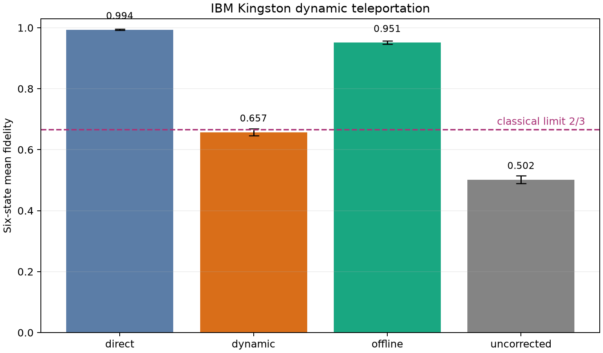
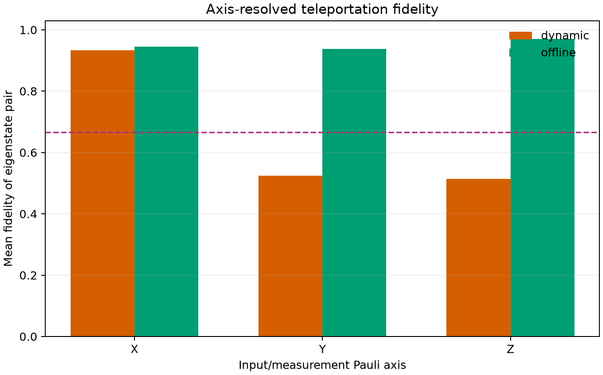
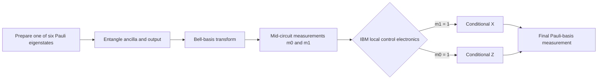
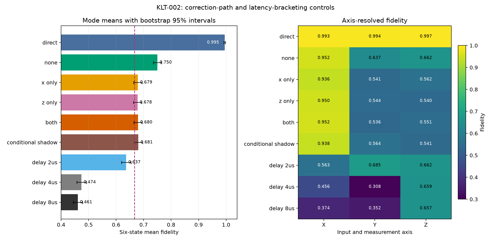

# Kingston Live Teleportation

A reproducible, QPU-budget-capped study of real-time classical feed-forward on
IBM Quantum's 156-qubit `ibm_kingston` Heron R2 processor.

This repository asks a focused question: **can a cloud user teleport an unknown
qubit state and apply the Bell-measurement corrections while the destination
qubit is still active inside one dynamic circuit?**

The answer from this run is scientifically useful but not simply “yes.” The
Bell correlations survived with high fidelity when corrected offline, while
the live feed-forward path was strongly axis-dependent and did not establish
average teleportation fidelity above the classical limit.



## Result at a glance

The preregistered experiment used physical qubits `[147, 148, 149]`, six Pauli
eigenstates, 1,024 shots per physical circuit, and no error mitigation.

| Estimator | Mean fidelity | 95% interval | Interpretation |
|---|---:|---:|---|
| Direct | 0.9937 | [0.9915, 0.9956] | Transpiled output-qubit SPAM/readout baseline |
| Dynamic | 0.6574 | [0.6465, 0.6683] | Live on-device feed-forward |
| Offline | 0.9512 | [0.9456, 0.9564] | Same Bell correlations, corrected after execution |
| Uncorrected | 0.5018 | [0.4894, 0.5143] | Negative control |

The classical measure-and-prepare threshold is `2/3 ≈ 0.6667`. The dynamic
point estimate was below it, and its 95% interval included it. Therefore, the
primary preregistered hypothesis was **not supported**.

The offline result matters: `0.9512` fidelity shows that the teleportation
correlations were present. The large difference between offline and dynamic
correction localizes the interesting behavior to the live-control path rather
than to a complete failure of entanglement or Bell measurement.

### Axis-resolved behavior



| Pauli axis | Dynamic fidelity | Offline fidelity | Dynamic PTM diagonal |
|---|---:|---:|---:|
| X | 0.9331 | 0.9453 | 0.8662 |
| Y | 0.5249 | 0.9375 | 0.0498 |
| Z | 0.5142 | 0.9707 | 0.0283 |

The live channel nearly preserved X eigenstates while losing most Y and Z
information. Phenomenologically, that resembles an effective random-X channel.
It is a description of the observed channel—not proof of a specific hardware
fault or microscopic mechanism.

## What was tested

For each input state `|ψ⟩`, the experiment:

1. prepared `|ψ⟩` on the input qubit;
2. created a Bell pair between the ancilla and destination qubits;
3. performed a Bell-basis transformation;
4. measured the input and ancilla in the middle of the circuit;
5. used IBM's on-device `if_else` control flow to apply `X^m1 Z^m0` to the
   still-active destination qubit;
6. measured the destination in the matching X, Y, or Z basis.



The six states—`|0⟩`, `|1⟩`, `|+⟩`, `|−⟩`, `|+i⟩`, and `|−i⟩`—form a spherical
2-design. Their equally weighted mean fidelity estimates channel-average
teleportation fidelity.

### Matched estimators

| Estimator | Physical procedure | Scientific role |
|---|---|---|
| `direct` | Prepare and measure on the output qubit; inverse rotations cancel in the transpiled positive-state circuits | Output computational-basis SPAM/readout baseline |
| `dynamic` | Teleport and apply both corrections inside the active circuit | Primary live-feedback measurement |
| `uncorrected` | Teleport but omit both corrections | Expected ≈0.5 negative control |
| `offline` | Reinterpret the uncorrected joint outcomes using the Bell bits | Tests whether teleportation correlations survived |

Offline correction is not operationally equivalent to live correction: it can
recover statistics after the job, but it cannot supply a corrected quantum
state to subsequent quantum gates.

The direct estimator also needs a precise qualification. Transpilation cancels
the preparation and measurement rotations for the positive X and Y states;
their ISA circuits contain only terminal measurement, while negative states
reduce to X plus measurement. Its unchanged value is therefore a strong
output-qubit computational-basis baseline, not an independent six-state SPAM
estimate. See [`docs/DIRECT_CONTROL_NOTE.md`](docs/DIRECT_CONTROL_NOTE.md).

## Exploratory diagnostics

These diagnostics were added after observing the preregistered axis asymmetry;
they are explicitly post-hoc and are not part of the primary hypothesis test.

### Individual register/correction paths

| Conditional path | Agreement |
|---|---:|
| `m0 → X` | 1.0000 |
| `m0 → Z` | 0.9824 |
| `m1 → X` | 0.9961 |
| `m1 → Z` | 0.9902 |

### Two back-to-back conditionals

| Correction order | Readout basis | Agreement |
|---|---|---:|
| X then Z | X | 0.9824 |
| X then Z | Z | 0.9941 |
| Z then X | X | 0.9688 |
| Z then X | Z | 0.9941 |

These controls rule out the simplest explanations: neither classical register,
neither conditional gate, nor the ordering of two conditionals failed in
isolation. The anisotropy appears specific to the full teleportation/control
interaction on this qubit chain and calibration snapshot. The present data do
not identify a unique cause.

## Why cloud latency is not the circuit latency

Submitting a job from WSL involves internet transport, authentication,
compilation, scheduling, and queueing. That wall-clock delay can be seconds or
minutes, but it occurs **before** the active circuit begins.

Once the job starts, the complete dynamic circuit is already at IBM's facility.
Mid-circuit measurements and conditional gates are handled locally by IBM's
control electronics while the destination qubit remains part of the same
circuit execution. No measurement travels back to this laptop during the
coherence window.

This makes IBM dynamic circuits a real example of low-latency quantum/classical
feedback, but a more restricted one than a tightly coupled QPU–CPU–GPU system:

| Capability | This cloud experiment | Tightly coupled local system |
|---|---|---|
| Mid-circuit measurement | Yes | Yes |
| Precompiled conditional gates | Yes | Yes |
| Arbitrary user Python callback while qubits are live | No | Potentially |
| User GPU processing inside the coherence window | No | Potentially |
| Pulse/controller-level instrumentation | Not exposed | May be exposed |
| Direct measurement of controller round-trip latency | Not exposed | Possible |

## Limitations

The results should be interpreted within the following boundaries:

- **One backend and one chain.** The experiment used only qubits
  `[147, 148, 149]` on `ibm_kingston`; it does not characterize the entire QPU
  or IBM fleet.
- **One calibration window.** Calibration drift could change the result. This
  repository records the backend snapshot, but it does not establish temporal
  repeatability.
- **Cloud abstraction.** Public access does not expose pulse schedules,
  controller traces, discriminator internals, or the exact latency of each
  conditional path. We can observe the effective channel but cannot attribute
  it to a unique hardware cause.
- **No delay-matched control.** Offline circuits omit live conditionals, so the
  dynamic/offline difference combines conditional latency, added operations,
  scheduling, decoherence, and possible measurement/control interactions.
- **No mitigation.** This was deliberate to keep the comparison transparent
  and QPU usage low, but reported values are raw hardware performance.
- **Finite sampling.** The main study used 1,024 shots per circuit. Intervals
  quantify shot uncertainty, not calibration or device-to-device variation.
- **Post-hoc diagnostics.** The two diagnostic jobs help constrain simple
  explanations but were designed after seeing the main result.
- **Not NVQLink replication.** The experiment demonstrates IBM's restricted
  precompiled feed-forward model; it does not reproduce arbitrary GPU/CPU
  callbacks into a live quantum controller.
- **No quantum advantage claim.** This is a control-path characterization, not
  evidence of useful fault tolerance or computational speedup.

## KLT-002 preregistered follow-up — completed

The follow-up separates
X-only, Z-only, both, and neither correction and adds a two-conditional shadow
control plus 2, 4, and 8 μs destination delays. Six states across nine modes
gave 54 circuits at 512 shots each. IBM job `dal13ss62pvc739q7gig` completed
successfully using **10 QPU seconds**.

X-only, Z-only, both-correction, and conditional-shadow modes all produced
nearly identical six-state means (`0.6781`–`0.6810`) with high X but weak Y/Z
fidelity. The shadow was within the preregistered 0.03 margin of both correction
on every axis. No 2/4/8 μs delay reproduced that channel: the explicit delays
were qualitatively Z-preserving, while conditional modes were X-preserving.

IBM returned accurate timing for all 54 circuits. For matched `|+⟩` circuits,
both corrections added about 0.768 μs beyond the no-branch wait, while the
shadow added 0.624 μs. The smallest explicit delay added exactly 2 μs, so the
controls correctly bracketed but did not numerically match branch latency.



Full design, evidence, and interpretation:

- [`preregistrations/KLT-002_DELAY_CORRECTION_PREREGISTRATION.md`](preregistrations/KLT-002_DELAY_CORRECTION_PREREGISTRATION.md)
- [`followups/klt-002-delay-corrections/RESULTS.md`](followups/klt-002-delay-corrections/RESULTS.md)
- [`docs/TIMING_AUDIT.md`](docs/TIMING_AUDIT.md)
- [`docs/REPLICATION_PROTOCOL.md`](docs/REPLICATION_PROTOCOL.md)

## QPU usage and safeguards

IBM reported exactly **23 cumulative QPU-seconds** across four jobs:

| Job | IBM job ID | QPU seconds |
|---|---|---:|
| Preregistered experiment | `daktp8c62pvc739q1t6g` | 7 |
| Register/correction diagnostic | `daktrsgnf91c73crdckg` | 3 |
| Conditional-order diagnostic | `daktsvgnf91c73crddrg` | 3 |
| KLT-002 correction/timing study | `dal13ss62pvc739q7gig` | 10 |
| **Total** | | **23** |

The repository protects limited-access accounts in several ways:

- `simulate` and `preflight` never submit hardware work;
- submission requires the literal `--submit` flag;
- the main job refuses caps above 25 QPU-seconds;
- the diagnostics have separate hard ceilings of 8 and 5 seconds;
- KLT-002 fixes 512 shots, estimates 11.6768 seconds, and rejects caps above
  20 seconds;
- IBM's server-side `max_execution_time` enforces each cap;
- the design uses one Sampler job per stage, no Runtime session, and no
  mitigation expansion;
- every job's IBM-reported `quantum_seconds` value is preserved.

The local duration estimate is only a budget tripwire. IBM's target metadata
does not publish an `if_else` duration, so the fallback serially sums known
instruction durations and reserves 500 μs per conditional. The IBM server-side
cap is authoritative.

## Repository contents

```text
.
├── PREREGISTRATION.md          Frozen hypotheses and decision rules
├── PROVENANCE.md               Protocol IDs, commits, environments, evidence
├── CITATION.cff                Citation metadata
├── LICENSE                     Apache-2.0 license
├── preregistrations/           Frozen KLT-002 design
├── docs/                       Timing, direct-control, replication notes
├── RESULTS.md                  Narrative result and interpretation
├── environment.yml             Reproducible Conda environment
├── pyproject.toml              Package metadata and CLI entry point
├── src/kingston_live_teleportation/
│   ├── circuits.py             Six-state teleportation circuits
│   ├── analysis.py             Fidelity and bootstrap analysis
│   ├── diagnostics.py          Post-hoc control circuits
│   ├── followup.py             KLT-002 circuits and scoring
│   ├── followup_reporting.py   Timing extraction and result visualization
│   ├── followup_workflow.py    KLT-002 simulation/preflight/gated execution
│   ├── verification.py         Offline bundle and regeneration verifier
│   ├── workflow.py             Simulation, preflight, capped submission
│   └── report.py               Tables and figures
├── tests/                      Local unit tests
└── results/kingston-2026-09-15/
    ├── main/                   Preregistered counts, metrics, tables, plots
    ├── register-diagnostic/    Individual feed-forward controls
    ├── sequence-diagnostic/    Conditional-order controls
    └── SHA256SUMS              Integrity hashes
```

The curated result bundle contains raw joint counts, IBM job metrics, the live
preflight, per-state and axis-level tables, bootstrap summaries, and figures.
Transient run directories and credentials are excluded from Git.

## Reproduce locally

Create the environment:

```bash
conda env create -f environment.yml
conda activate kingston-teleport
pytest
kingston-teleport verify-results
kingston-teleport verify-followup
```

Run the ideal simulator without contacting IBM hardware:

```bash
kingston-teleport simulate --shots 2048
```

Perform a read-only backend preflight:

```bash
kingston-teleport preflight \
  --backend ibm_kingston \
  --instance QEC \
  --physical-qubits 147 148 149 \
  --shots 1024
```

The exact preregistered hardware command was:

```bash
kingston-teleport run \
  --backend ibm_kingston \
  --instance QEC \
  --physical-qubits 147 148 149 \
  --shots 1024 \
  --max-qpu-seconds 25 \
  --submit
```

Hardware execution requires a separately configured IBM Quantum account and
may consume limited plan allocation. Reviewing `PREREGISTRATION.md` and a fresh
preflight artifact before submission is strongly recommended.

Regenerate and verify KLT-002 without using QPU time or network access:

```bash
kingston-teleport verify-followup
kingston-teleport report-followup
```

The completed job is not resubmitted by either command.

## Reproducibility and interpretation

- [`PREREGISTRATION.md`](PREREGISTRATION.md) is the frozen confirmatory design.
- [`RESULTS.md`](RESULTS.md) records the outcome, diagnostics, and interpretation.
- [`results/kingston-2026-09-15/`](results/kingston-2026-09-15/) contains the
  curated machine-readable evidence and SHA-256 hashes.
- [`PROVENANCE.md`](PROVENANCE.md) binds protocol identities to the archival
  commits and documents the required metadata for future artifacts.
- [`followups/klt-002-delay-corrections/`](followups/klt-002-delay-corrections/)
  contains KLT-002 raw evidence, exact timing, decisions, and derived outputs.

The principal value of this repository is the separation between three layers:
the quantum correlations, the live control path, and the cloud service around
them. The data show that good offline correlations do not automatically imply
that an equivalent live-correction circuit will preserve the same effective
channel.
